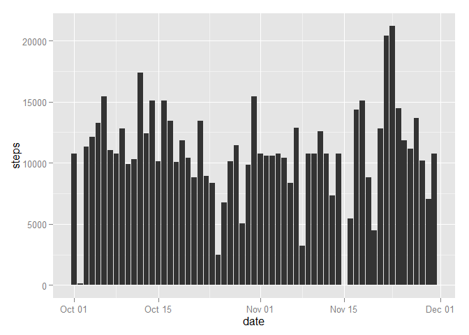

# Reproducible Research: Peer Assessment 1


## Loading and preprocessing the data

######1. Load the data

Below the csv file is stored in a data.frame called `data`.

```r
data <- read.csv("activity.csv", stringsAsFactors=FALSE)
```

######2. Process/transform the data (if necessary) into a format suitable for your analysis.

The `date` column is transformed from character to date.


```r
data$date <- as.Date(data$date, "%Y-%m-%d")
```

## What is mean total number of steps taken per day?

######1. Calculate the total number of steps taken per day

The NA values for `steps` are removed by subsetting the data for any records that are **not** equal to NA.

```r
naStepsRemoved <- subset(data, !is.na(data$steps))
```

The total steps taken per day is calculated using the `aggregate()` and `sum()` functions and stored in the data.frame called `totalStepsPerDay`. The final result does not contain the original column names therefore they have to be assigned again using `colnames()`.


```r
totalStepsPerDay <- aggregate(naStepsRemoved$steps, by=list(naStepsRemoved$date), FUN=sum)
colnames(totalStepsPerDay) <- c("date","steps")
```

######2. Make a histogram of the total number of steps taken each day

The calculated total steps per day in the data.frame `totalStepsPerDay` are plotted as a histogram using `ggplot()`. The NA records that were removed appear as gaps.


```r
library("ggplot2")
ggplot(data = totalStepsPerDay, aes(date,steps)) + geom_bar(stat="identity")
```

 

######3. Calculate and report the mean and median of the total number of steps taken per day

The mean is calculated using the function `mean()`.

```r
mean(totalStepsPerDay$steps)
```

```
## [1] 10766.19
```
The median is calculated using the function `mean()`.

```r
median(totalStepsPerDay$steps)
```

```
## [1] 10765
```

## What is the average daily activity pattern?

######1. Make a time series plot of the 5-minute interval (x-axis) and the average number of steps taken, averaged across all days (y-axis).

The average steps taken for each inteveral and across all days is calculated using the `aggregate()` and `mean()` functions and stored in the data.frame `averageStepsAcrossInterval`. The final result does not contain the original column names therefore they have to be assigned again using `colnames()`.


```r
averageStepsAcrossInterval <- aggregate(naStepsRemoved$steps, by=list(naStepsRemoved$interval), FUN=mean)
colnames(averageStepsAcrossInterval) <- c("interval","steps")
```

The calculated average steps for each interval across all days in the data.frame `totalStepsPerDay` are plotted as a line plot using `ggplot()`.


```r
ggplot(data=averageStepsAcrossInterval, aes(x=interval, y=steps)) + geom_line(colour="blue")
```

 

######2. Which 5-minute interval, on average across all the days in the dataset, contains the maximum number of steps?

First the maximum value in the data.frame is retrieved using the `max()` function.

```r
max(averageStepsAcrossInterval$steps)
```

```
## [1] 206.1698
```

The maximum value of `206.1698` returned from the `max()` function is inserted into the `grep()` function in order to find the location/index of this value in the data set. 

```r
grep(206.1698, averageStepsAcrossInterval$steps)
```

```
## [1] 104
```

The index of `104` returned from the `grep()` function is then subsetted in the data set to determine which interval has the maximum number of steps.

```r
averageStepsAcrossInterval[104,]
```

```
##     interval    steps
## 104      835 206.1698
```

As shown from the results returned above, the 5-minute interval `835` contains the maximum number of steps.

## Imputing missing values

######1. Calculate and report the total number of missing values in the dataset.

The NA values in the column `steps` are retrieved using the `subset()` and `is.na()` functions.

```r
naSteps <- subset(data, is.na(data$steps))
```
The total number of missing values is equal to the number of rows in the `naSteps` data set and therefore can be retrieved using the `nrow()` function.

```r
nrow(naSteps)
```

```
## [1] 2304
```
The total number of missing values in the dataset is: `2304`

######2. Devise a strategy for filling in all of the missing values in the dataset.

The strategy chosen is to fill the missing values with the average number of steps taken for all 5-minute intervals.

The average steps for all intervals is calculated using the previously calculated `averageStepsAcrossInterval` and applying the `mean()` function for the column steps.

```r
mean(averageStepsAcrossInterval$steps)
```

```
## [1] 37.3826
```

Another way to obtain this result would be to divide the mean number of steps taken per day and divide this by the 288 5-minute intervals in each day. (10766.19/288):

```r
mean(totalStepsPerDay$steps)/288
```

```
## [1] 37.3826
```

######3. Create a new dataset that is equal to the original dataset but with the missing data filled in.

The original data.frame is duplicated and named `dataWithFilledNAs`.

```r
dataWithFilledNAs <- data
```
The NA values in the first column (`steps`) are replaced with the value `37.3826` which is the average number of steps for all intervals calculated in the previous step.

```r
dataWithFilledNAs[,1] <- replace(dataWithFilledNAs[,1], is.na(dataWithFilledNAs[,1]), 37.3826)
```

######4. a) Make a histogram of the total number of steps taken each day.

The calculated total steps per day in the data.frame `dataWithFilledNAs` are plotted as a histogram using `ggplot()`.


```r
ggplot(data = dataWithFilledNAs, aes(date,steps)) + geom_bar(stat="identity")
```

 

######4. b) Calculate and report the mean and median total number of steps taken per day.

The total steps taken per day is calculated using the `aggregate()` and `sum()` functions and stored in the data.frame called `totalStepsPerDay2`. The final result does not contain the original column names therefore they have to be assigned again using `colnames()`.


```r
totalStepsPerDay2 <- aggregate(dataWithFilledNAs$steps, by=list(dataWithFilledNAs$date), FUN=sum)
colnames(totalStepsPerDay2) <- c("date","steps")
```

The mean is calculated using the function `mean()`


```r
mean(totalStepsPerDay2$steps)
```

```
## [1] 10766.19
```

The median is calculated using the function `median()`.


```r
median(totalStepsPerDay2$steps)
```

```
## [1] 10766.19
```

######4. c) Do these values differ from the estimates from the first part of the assignment? What is the impact of imputing missing data on the estimates of the total daily number of steps?

The average/mean value of `10766.19` has not changed from the first part of the assignment however the median changed from `10765` to `10766.19`.


## Are there differences in activity patterns between weekdays and weekends?

######1. Create a new factor variable in the dataset with two levels - "weekday" and "weekend"

The data with NAs replaced is copied to the new data frame `dataWithDays`. The function `weekdays()` is used to convert the date to Monday-Sunday values and inserted as a new column. The new/4th column is then named using the function `colnames()`.


```r
dataWithDays <- dataWithFilledNAs
dataWithDays[,4] <- weekdays(dataWithFilledNAs$date)
colnames(dataWithDays) <- c("steps","date","interval","weekday")
```

The values that match "Saturday" and "Sunday" are replaced with the value "Weekend".


```r
dataWithDays[,4] <- replace(dataWithDays[,4], dataWithDays[,4] %in% c("Saturday","Sunday"), "Weekend")
```

The values that do not match "Weekend" are replaced with the value "Weekday".

```r
dataWithDays[,4] <- replace(dataWithDays[,4], !(dataWithDays[,4] %in% "Weekend"), "Weekday")
```

The factor is created for the new column using the `factor()` function.

```r
dataWithDays[,4] <- factor(dataWithDays[,4])
```

######2. Make a panel plot containing a time series plot of the 5-minute interval (x-axis) and the average number of steps taken, averaged across all weekday days or weekend days (y-axis). 

The average steps taken for each inteveral and across all weekends and weekdays is calculated using the `aggregate()` and `mean()` functions and stored in the data.frame `averageStepsAcrossIntervalWeekdays`. The final results does not contain the original column names therefore they have to be assigned again using `colnames()`.

```r
averageStepsAcrossIntervalWeekdays <- aggregate(dataWithDays$steps, by=list(dataWithDays$interval,dataWithDays$weekday), FUN=mean)
colnames(averageStepsAcrossIntervalWeekdays) <- c("interval","Weekday","steps")
```

The calculated average steps for each interval across weekends and weekdays are plotted as two seperate line plots using `ggplot()`.


```r
ggplot(data = averageStepsAcrossIntervalWeekdays, aes(interval,steps)) + geom_line(colour="blue") + facet_wrap(~Weekday, nrow=2)
```

 
